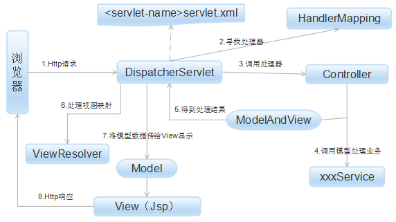

- [1. Xml配置文件详解](#1-xml配置文件详解)
- [2. SpringMVC的请求流程](#2-springmvc的请求流程程)

#### 1. Xml配置文件详解

```xml
<?xml version="1.0" encoding="UTF-8" standalone="no"?>
<beans xmlns="http://www.springframework.org/schema/beans"
       xmlns:context="http://www.springframework.org/schema/context"
       xmlns:mvc="http://www.springframework.org/schema/mvc"
       xmlns:p="http://www.springframework.org/schema/p"
       xmlns:websocket="http://www.springframework.org/schema/websocket"
       xmlns:xsi="http://www.w3.org/2001/XMLSchema-instance"
       xsi:schemaLocation="http://www.springframework.org/schema/beans
       http://www.springframework.org/schema/beans/spring-beans-4.0.xsd
       http://www.springframework.org/schema/context http://www.springframework.org/schema/context/spring-context-4.0.xsd
       http://www.springframework.org/schema/mvc http://www.springframework.org/schema/mvc/spring-mvc-4.0.xsd
       http://www.springframework.org/schema/websocket http://www.springframework.org/schema/websocket/spring-websocket-4.0.xsd">
<!-- <mvc:annotation-driven /> 会自动注册DefaultAnnotationHandlerMapping与AnnotationMethodHandlerAdapter 两个bean,是spring MVC为@Controllers分发请求所必须的。它提供了数据绑定支持，读取json的支持 -->
    <mvc:annotation-driven />  
    <!-- 设置自动注入bean的扫描范围，use-default-filters默认为true，会扫描所有的java类进行注入 ，-->    
    <!-- Use-dafault-filters=”false”的情况下：<context:exclude-filter>指定的不扫描，<context:include-filter>指定的扫描 -->
    <!-- springmvc和application文件都需要配置，但mvc文件只扫描controller类，application扫描不是controller类 -->    
    <context:component-scan base-package="mytest.*" use-default-filters="false">
        <context:include-filter expression="org.springframework.stereotype.Controller" type="annotation"/>
    </context:component-scan>
    <!-- 文件上传功能需该配置 -->
    <bean class="org.springframework.web.multipart.commons.CommonsMultipartResolver" id="multipartResolver">
    <property name="defaultEncoding" value="UTF-8"/>
    </bean>
    <!-- ResourceBundleThemeSource是ThemeSource接口默认实现类-->
    <bean class="org.springframework.ui.context.support.ResourceBundleThemeSource" id="themeSource"/>
    <!-- 用于实现用户所选的主题，以Cookie的方式存放在客户端的机器上-->
    <bean class="org.springframework.web.servlet.theme.CookieThemeResolver" id="themeResolver" p:cookieName="theme" p:defaultThemeName="standard"/>
    
    <!-- 由于web.xml文件中进行了请求拦截
    <servlet-mapping> 
<servlet-name>dispatcher</servlet-name> 
<url-pattern>/</url-pattern> 
</servlet-mapping> 
这样会影响到静态资源文件的获取，mvc:resources的作用是帮你分类完成获取静态资源的责任
-->
    <mvc:resources mapping="/resources/**" location="/WEB-INF/resources/" />
    <!-- 配置使用 SimpleMappingExceptionResolver 来映射异常 -->
    <bean class="org.springframework.web.servlet.handler.SimpleMappingExceptionResolver" >
        <!-- 定义默认的异常处理页面 -->  
    <property name="defaultErrorView" value="error"/> 
         <!-- 
        配置异常的属性值为ex，那么在错误页面中可以通过 ${exception} 来获取异常的信息
        如果不配置这个属性，它的默认值为exception
         -->
        <property name="exceptionAttribute" value="exception"></property>
        <property name="exceptionMappings">
            <props>
            <!-- 映射特殊异常对应error.jsp这个页面 -->
                <prop key=".DataAccessException">error</prop>
                <prop key=".NoSuchRequestHandlingMethodException">error</prop>
                <prop key=".TypeMismatchException">error</prop>
                <prop key=".MissingServletRequestParameterException">error</prop>
            </props>
        </property>
    </bean>
    <!-- 配置jsp视图解析器 -->
    <bean class="org.springframework.web.servlet.view.InternalResourceViewResolver" id="jspViewResolver">
        <property name="viewClass" value="org.springframework.web.servlet.view.JstlView"/>
        <property name="prefix" value=""/>
        <property name="suffix" value=".jsp"/>
    </bean>
</beans>
```

- `<mvc:default-servlet-handler/>`

在web.xml配置中，我们将DispatcherServlet的拦截路径设置为“/”，则spring会捕获所有的web请求，包括对静态资源的请求，为了正确处理对静态资源的请求，spring提供了两种解决方案：

1. 配置`<mvc:default-servlet-handler/>`：配置`<mvc:default-servlet-handler/>`后，会在SpringMVC上下文中定义一个org.springframework.web.servlet.resource.DefaultServletHttpRequestHandler，它会对进入DispatcherServletdeURL进行筛查如果发现是静态资源的请求，就将该请求的转由Web应用服务器默认的Servlet处理， 如果不是静态资源的请求，才由DispatcherServlet继续处理
2. 配置`<mvc:resources />`：指定静态资源的位置和路径映射

```xml
<mvc:resources location="/img/" mapping="/img/**"/>   
<mvc:resources location="/js/" mapping="/js/**"/>    
<mvc:resources location="/css/" mapping="/css/**"/>
```

- `<mvc:annotation-driven/>`

`<mvc:annotation-driven/>`会自动注册DefaultAnnotationHandlerMapping与AnnotationMethodHandlerAdapter两个Bean，用以支持@Controller分发请求。并提供了数据绑定、参数转换、json转换等功能，所以必须加上这个配置

#### 2. SpringMVC的请求流程



1. **Http请求**：客户端请求到DispatcherServlet
2. **寻找处理器**：由DispatcherServlet控制器查询一个或多个HandlerMapping，找到处理请求的Controller
3. **调用处理器**：DispatcherServlet将请求提交到Controller
4. **调用业务处理和返回结果**：Controller调用业务逻辑处理后，返回ModelAndView
5. **处理视图映射并返回结果**：DispatcherServlet查询一个或多个ViewResolver视图解析器，找到ModelAndView指定的视图
6. **Http响应**：视图负责将结果显示到客户端