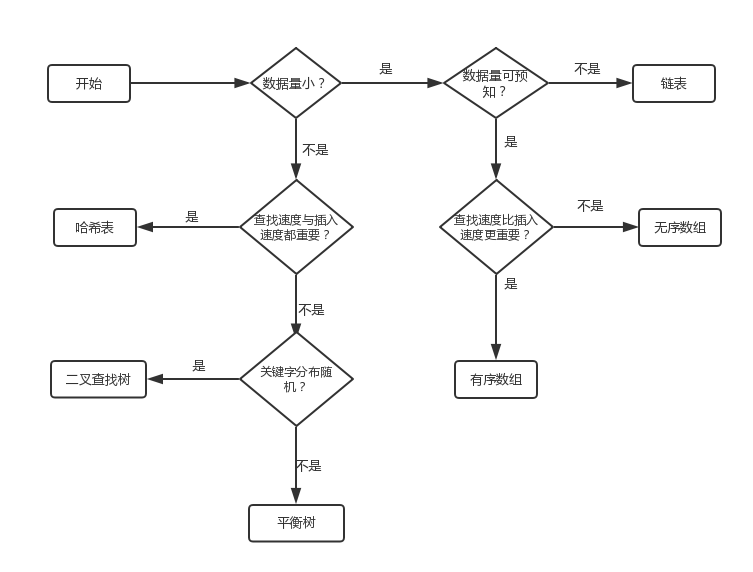

- [1. 常见的数据结构](#1-常见的数据结构)
- [2. 数据结构的选择](#2-数据结构的选择)
- [3. 数组(Array)](#3-数组array)
- [4. 链表(LinkedList)](#4-链表linkedlist)
- [5. 队列(Queue)](#5-队列queue)
- [6. 栈(Stack)](#6-栈stack)
- [7. 堆(Heap)](#7-堆heap)


按逻辑结构分类：

- 集合（无逻辑关系）
- 线性结构（线性表）
  1. 一维数组
  2. 队列
  3. 栈
- 非线性结构
  1. 树
  2. 图
  3. 多维数组

按存储结构分类：

- 顺序存储结构
- 链式存储结构
- 索引存储结构
- 散列存储结构

每种逻辑结构采用何种物理结构来实现，并没有具体的规定。当一个结构，在逻辑结构中只有一种定义，而在物理结构中却有两种定义，那么这个结构就属于逻辑结构；

**数据结构的比较**

| **数据结构** |                          **优点**                          |                       **缺点**                       |
| :----------: | :--------------------------------------------------------: | :--------------------------------------------------: |
|     数组     |                           插入快                           |     查找慢，删除慢，大小固定，只能存储的那一元素     |
|   有序数组   |                      比无序数组查询快                      |      插入慢，删除慢，大小固定，只能存储单一元素      |
|      栈      |                   提供先进先出的存取方式                   |                    存储其它项很慢                    |
|     队列     |                   提供先进先出的存取方式                   |                    存取其它项很慢                    |
|     链表     |                       插入快，删除快                       |                        查找慢                        |
|    二叉树    |           如果树是平衡的，则查找，插入，删除都快           |                     删除算法复杂                     |
|    红黑树    | 查找，插入，删除都快。树总是平衡的，类似的树对磁盘存储有效 |                       算法复杂                       |
|   2-3-4 树   | 查找，插入，删除都快。树总是平衡的，类似的树对磁盘存储有效 |                       算法复杂                       |
|    哈希表    |                  如果关键字已知则存取极快                  | 删除慢，如果不知道关键字存取慢，对存储空间使用不充分 |
|      堆      |              插入，删除快，对最大数据项存取快              |                  对其它数据项存取慢                  |
|      图      |                       对现实世界建模                       |                   有些算法慢且复杂                   |

#### 1. 常见的数据结构

- 队列（Queue）
- 树（Tree）
- 堆（Heap）
- 数组（Array）
- 栈（Stack）
- 链表（LinkedList）
- 图（Graph）
- 散列表-哈希表（Hash）

#### 2. 数据结构的选择



#### 3. 数组(Array)

在Java中，数组是用来存放同一种数据类型的集合，注意只能存放同一种数据类型。

```java
// 只声明了类型和长度
数据类型[] 数组名称 = new 数据类型[数组长度];
// 声明了类型，初始化赋值，大小由元素个数决定
数据类型[] 数组名称 = {元素1, 元素2, ....};
// 缺点：大小固定，不能动态扩展(初始化给大了，浪费；给小了，不够用)，插入快，删除和查找慢
```

模拟实现：

```java
public class Array
{
    private int[] intArray;
    private int length;
    private int elems;

    public Array(int max) {
        length = max;
        intArray = new int[max];
        elems = 0;
    }

    /**
     * 添加
     * @param value
     */
    public void add(int value) {
        if (elems == length) {
            System.out.println("error");
            return;
        }
        intArray[elems] = value;
        elems++;
    }

    /**
     * 查找
     * @param searchKey
     * @return
     */
    public int find(int searchKey) {
        int i;
        for (i = 0; i < elems; i++) {
            if (intArray[i] == searchKey) {
                break;
            }
        }
        if (i == elems) {
            return -1;
        }
        return i;
    }

    /**
     * 更新(修改)
     * @param oldValue
     * @param newValue
     * @return
     */
    public boolean update(int oldValue, int newValue) {
        int i = find(oldValue);
        if (i == -1) {
            return false;
        }
        intArray[i] = newValue;
        return true;
    }

    /**
     * 删除
     * @param value
     * @return
     */
    public boolean delete(int value) {
        int i = find(value);
        if (i == -1) {
            return false;
        }
        for (int j = i; i < elems - 1; j++) {
            // 后面的数据往前移
            intArray[j] = intArray[j + 1];
        }
        elems--;
        return true;
    }

    /**
     * 显示所有
     */
    public void display() {
        for (int i = 0; i < elems; i++) {
            System.out.println(intArray[i] + " ");
        }
        System.out.println("\n");
    }
}
```

#### 4. 链表(LinkedList)

- 链表即是由节点组成的线性集合，每个节点可以利用指针指向其他节点。它是一种包含了多个节点的、能够用于表示序列的数据结构
- `单向链表`：链表中的节点仅指向下一个节点，并且最后一个节点指向空
- `双向链表`：其中每个节点具有两个指针p、n，使得p指向先前节点并且n之前下一节点；最后一个节点的n指针指向null
- `循环链表`：每个节点指向下一节点并且最后一个节点指向第一个节点的链表

```java
public class LinkedList
{

    // 链表头
    private Node head;
    // 链表尾
    private Node tail;
    // 节点数
    private int size;

    public static void main(String[] args) {
        LinkedList linkedlist = new LinkedList();
        linkedlist.addHead("456");
        linkedlist.addHead("123");
        //linkedlist.addTail("hello ");
        //linkedlist.addTail("word");
        //linkedlist.deleteHead();
        //linkedlist.deleteTail();
        linkedlist.display();
    }    

    /**
     * 双端链表
     */
    public class Node {
        private Object data;
        // 上一个
        private Node prev;
        // 下一个
        private Node next;

        public Node(Object data) {
            this.data = data;
        }
    }

    public LinkedList() {
        this.head = null;
        this.tail = null;
        this.size = 0;
    }

    /**
     * 向链表头添加数据
     * @param object
     */
    public void addHead(Object object) {
        Node node = new Node(object);
        if (size == 0) {
            head = node;
            tail = node;
            size++;
        } else {
            head.prev = node;
            node.next = head;
            head = node;
            size++;
        }
    }

    /**
     * 删除头
     */
    public void deleteHead() {
        // 头部指向下一个，prev值为空则说明是链表的头部
        if (size != 0) {
            head.prev = null;
            head = head.next;
            size--;
        }
    }

    /**
     * 向链表尾部添加数据
     */
    public void addTail(Object object) {
        Node node = new Node(object);
        if (size == 0) {
            head = node;
            tail = node;
            size++;
        } else {
            node.prev = tail;
            tail.next = node;
            tail = node;
            size++;
        }
    }

    /**
     * 删除尾部
     */
    public void deleteTail() {
        // 尾部指向上一个，next值为null则说明是链表的尾部
        if (size != 0) {
            tail.next = null;
            tail = tail.prev;
            size--;
        }
    }

    /**
     * 显示数据
     */
    public void display() {

        if (size > 0) {
            Node node = head;
            int tempSize = size;
            if (tempSize == 1) {
                System.out.println("["+node.data+"]");
                return;
            }

            while (tempSize > 0) {
                if (node.equals(head)) {
                    System.out.print("["+node.data+"->");
                } else if (node.next == null) {
                    System.out.print(node.data+"]");
                } else {
                    System.out.print(node.data+"->");
                }
                node = node.next;
                tempSize--;
            }
        }
    }
}
```

#### 5. 队列(Queue)

- 队列是元素的集合，其包含了两个基本操作：enqueue操作可以用于将元素插入到队列中，而dequeue操作则是将元素从队列中删除
- 咨询先入先出的原则(FIFO)

```java
public class Queue {
    /**
     * 1. 单向队列(Queue):只能在一端插入数据，另一端删除数据
     * 2. 双向队列(Deque):每一端都可以进行插入、删除数据
     *
     * 与栈不同的是，队列中的数据并不总是从数组的0下标开始的
     * 选择的做法是移动队头和队尾的指针
     * 为了避免队列不满却不能插入新的数据，我们可以让队尾指针绕回到数组开始的位置，这也称为“循环队列”
     */
    
    // 单向循环队列，顺序存储结构实现
    private Object[] objQueue;
    // 队列大小
    private int maxSize;
    // 顶部
    private int top;
    // 底部
    private int bottom;
    // 实际元素
    private int item;
    
    public Queue(int size) {
        maxSize = size;
        top = 0;
        bottom = -1;
        item = 0;
      	objQueue = new Object[maxSize];
    }
    
    public void add(Object obj) {
        if (item == maxSize) {
            throw new RunTimeException("queue is null");
        }
        // 控制下标的位置
        if (bottom == maxSize -1) {
            bottom = -1;
        }
        objQueue[++bottom] = obj;
        item++;
    }
    
    public Object out() {
        if (item == 0) {
            throw new RunTimeException("queue is null");
        }
        Object obj = objQueue[top];
         // 声明原顶栈可以回收空间(GC)
        objQueue[top] = null;
        top++;
        // 重置下标
        if (top == maxSize) {
            top = 0;
        }
        item--;
        
        return obj;
    }
    
    // 链式队列
    private class NodeQueue<Object> {
        private Object data;
        private NodeQueue next;
        
        public NodeQueue(Object data, NodeQueue next) {
            this.data = data;
            this.next = next;
        }
    }
    
    private NodeQueue queueTop;
    private NodeQueue queueBottom;
    private int size;
    
    public Queue() {
        queueTop = null;
        queueBottom = null;
        size = 0;
    }
    
    public void addNodeQueue(Object obj) {
        if (size == 0) {
            queueTop = new NodeQueue(obj, null);
            // 指向统一存储地址
            queueBottom = queueTop;
        } else {
            NodeQueue<Object> nodeQueue = new NodeQueue<>(obj, null);
            // 让尾节点的next指向新增的节点
            queueBottom.next = nodeQueue;
            // 以新节点作为尾节点
            queueBottom = nodeQueue;
        }
        size++;
    }
    
     /**
     * 出队
     * @return
     */
    public Object removeNodeQueue() {
        if (size == 0) {
            throw new RuntimeException("queue is null");
        }
        NodeQueue nodeQueue = queueTop;
        queueTop = queueTop.next;
        // 声明原队列头next可以回收 空间(GC)
        nodeQueue.next = null;
        size--;

        return nodeQueue.data;
    }

    @Override
    public String toString()
    {
        StringBuilder sb = new StringBuilder("{ ");
        for (NodeQueue nodeQueue = queueTop; nodeQueue != null; nodeQueue = nodeQueue.next) {
            sb.append(nodeQueue.data.toString() + " ");
        }
        return sb.toString() + "}";
    }

    public static void main(String[] args)
    {
        Queue queue = new Queue();
        queue.addNodeQueue("123");
        queue.addNodeQueue("abc");
        queue.addNodeQueue("ddd");
        System.out.println(queue);
        queue.removeNodeQueue();
        System.out.println(queue);
        queue.removeNodeQueue();
        queue.removeNodeQueue();
        System.out.println(queue);
    }
}
```

#### 6. 栈(Stack)

- 栈(stack)又称为堆栈或堆叠，栈作为一种数据结构，他按照先进后出的原则存储数据，先进入的数据被压入栈底，最后的数据在栈顶
- Java中Stack是Vector的一个子类，只定义了默认构造函数，用来创建一个空栈
- 栈是元素的集合，其包含了两个基本操作：push操作可以用于将元素压入栈，pop操作可以用于将栈顶元素移除
- 遵循后入先出(LIFO)原则

```java
public class Stack {
    private Object[] objArray;
    private int maxSize;
    private int top;
    
    public Stack(){}
    
    public Stack(int maxSize) {
        if (maxSize > 0) {
            this.maxSize = maxSize;
            objArray = new Object[maxSize];
            this.top = -1;
        } else {
            throw new RuntimeException("初始化失败");
        }
    }
    
    public void push(Object obj) {
        // 扩容
        grow();
        objArray[++top] = obj;
    }
    
    public Object pop() {
        Object obj = peekPop();
        objArray[top--] = null;
        
        return obj;
    }
    
    public Object peekPop() {
        if (top != -1) {
            return objArray[top];
        } else {
            throw new RuntimeException("stack is null");
        }
    }
    
    public void grow() {
        if (top == maxSize -1) {
            maxSize = maxSize<<1;
            objArray = Arrays.copyOf(objArray, maxSize);
        }
    }
    
    private class Node<Object> {
        private Object data;
        private Node next;
        
        public Node(Object data, Node next) {
            this.data = data;
            this.next = next;
        }
    }
    
    private Node nodeTop;
  	private int size;
    
    public void nodePush(Object obj) {
        nodeTop = new Node(obj, nodeTop);
        node.next = nodeTop;
        size++;
    }
    
    public Object nodePop() {
        Node old = nodeTop;
        nodeTop = old.next;
        old.next = null;
        size--;
        
        return old.data;
    }
    
    @Override
    public String toString()
    {
        StringBuilder sb = new StringBuilder("[ ");
        for (Node<Object> node = nodeTop; node != null; node = node.next) {
            sb.append(node.data.toString() + " ");
        }
        return sb.toString()+"]";
    }
    
    public static void main(String[] args)
    {
        /*Stack stack = new Stack(1);
        stack.objPush("123");
        stack.objPush("456");
        System.out.println(stack.peekTop());
        System.out.println(stack.objPop());
        System.out.println(stack.peekTop());*/
        Stack stack = new Stack();
        stack.nodePush("111");
        stack.nodePush("222");
        stack.nodePush("aaa");
        stack.nodePush("bbb");
        stack.nodePop();
        System.out.println(stack);
    }
}
```

#### 7. 堆(Heap)

- 堆(也被称为优先队列(队列+排序规则)，有最小堆和最大堆)
- 堆是一种特殊的基于树的满足某些特性的数据结构，整个堆中的所有父子节点的键值都会满足相同的排序条件。堆更准确的可以分为最大堆与最小堆，在最大堆中，父节点的键值永远大于或等于子节点的值，并且整个堆中的最大值存储于根节点；而最小堆中，父节点的键值永远小于或等于子节点的值，并且堆中最小值存储于根节点。